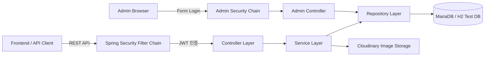
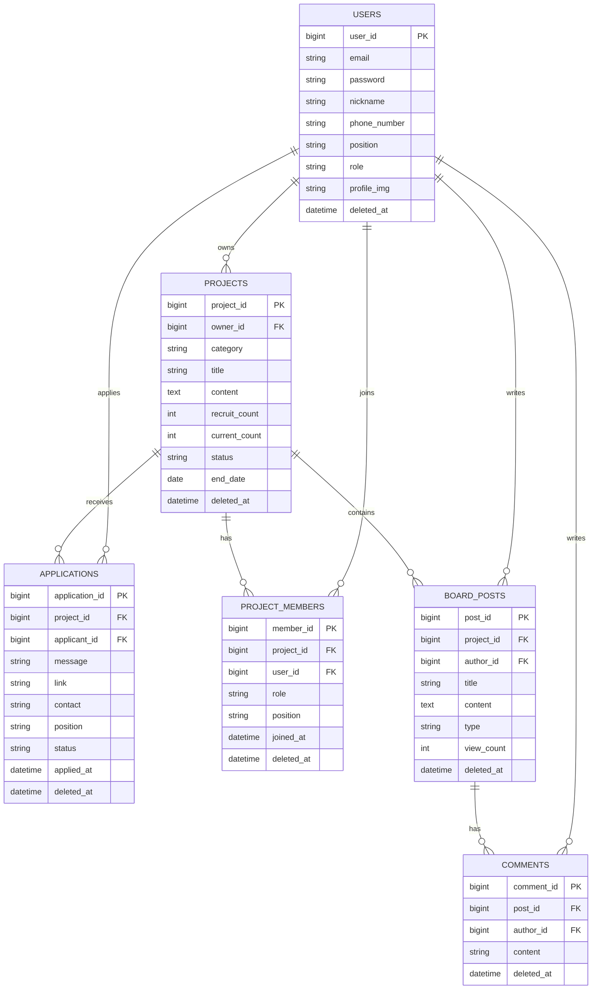

# Backend-MATE

> 개발자 프로젝트 팀원 모집, 지원, 승인, 프로젝트 멤버 관리, 게시판 소통을 지원하는 Spring Boot 기반 백엔드 서비스

<p>
  
  
  
  
  
  
</p>

## 소개 및 개요

- 프로젝트명: **Backend-MATE**
- Repository: [MiniProject2-MATE/Backend-MATE](https://github.com/MiniProject2-MATE/Backend-MATE)
- 개발 기간: 2026.03 ~ 2026.07
- 목적: 개발자들이 프로젝트 팀원을 모집하고, 지원서를 통해 합류하며, 프로젝트별 게시판에서 소통할 수 있는 REST API 서버 구현

Backend-MATE는 프로젝트 모집 플랫폼의 백엔드 API입니다. 사용자는 회원가입 후 자신의 포지션과 기술 스택을 등록하고, 프로젝트 모집글을 생성하거나 다른 프로젝트에 지원할 수 있습니다. 프로젝트 방장은 지원서를 승인/거절할 수 있고, 승인된 지원자는 프로젝트 멤버로 전환됩니다. 프로젝트 내부에는 게시글과 댓글 기능을 제공하며, 운영 관리를 위한 Thymeleaf 기반 관리자 페이지도 함께 제공합니다.

## 목차

- [팀 소개](#팀-소개)
- [아키텍처](#아키텍처)
- [ERD](#erd)
- [주요 기능](#주요-기능)
- [기술 스택](#기술-스택)
- [기술적 의사결정](#기술적-의사결정)
- [프로젝트 구조](#프로젝트-구조)
- [API 요약](#api-요약)
- [실행 방법](#실행-방법)
- [트러블슈팅 및 개선 포인트](#트러블슈팅-및-개선-포인트)

## 팀 소개

커밋 이력 기준으로 확인되는 팀원 GitHub 계정을 모두 연결했습니다.

| GitHub | 역할 | 주요 담당 영역 |
| :---: | :---: | :--- |
| [hongjiho5148](https://github.com/hongjiho5148) | Backend | 인증/인가, JWT, 회원 도메인, 프로젝트 도메인, 관리자 기능 |
| [Jangdochi](https://github.com/Jangdochi) | Backend | 프로젝트 모집, 지원서, 멤버 관리, 비즈니스 로직 |
| [Hyeonseok93](https://github.com/Hyeonseok93) | Backend | 게시판/댓글, API 연동, 서비스 계층 구현 |
| [nirey-l](https://github.com/nirey-l) | Backend | JPA 엔티티, Repository, DTO/Mapper, 데이터 흐름 |
| [pjcosmos](https://github.com/pjcosmos) | Backend | 관리자 페이지, 운영 로그, Soft Delete 관리 |
| [hjyouns](https://github.com/hjyouns) | Backend | API 보완, 테스트/검증, 협업 지원 |

## 아키텍처



### 계층별 책임

- Controller: HTTP 요청/응답 처리, 인증 사용자 식별, DTO 전달
- Service: 핵심 비즈니스 로직, 권한 검증, 트랜잭션 처리
- Repository: JPA 기반 데이터 접근
- Entity: 도메인 상태와 상태 변경 메서드 관리
- Security: JWT 발급/검증, 관리자 로그인, CORS, 인증 실패 처리
- Exception: 전역 예외 처리와 표준 에러 응답 관리

## ERD



## 주요 기능

<details>
<summary>회원 및 인증</summary>

- 이메일, 비밀번호, 닉네임, 전화번호 기반 회원가입
- BCrypt 기반 비밀번호 암호화
- 이메일/닉네임/전화번호 중복 검증
- Soft Delete된 데이터까지 포함한 중복 검증
- JWT Access Token 및 Refresh Token 발급
- Refresh Token DB 저장 및 로그아웃 시 삭제
- Access Token 만료 시 Refresh Token 기반 재발급
- 내 정보 조회 및 수정
- 기본 프로필 이미지 자동 지정

</details>

<details>
<summary>프로젝트 모집</summary>

- 프로젝트 모집글 생성
- 생성자를 OWNER 역할의 ProjectMember로 자동 등록
- 프로젝트 목록 조회
- 카테고리 및 키워드 기반 필터링
- 프로젝트 상세 조회
- 프로젝트 수정 및 삭제
- 모집 마감
- 재모집
- 모집 인원과 현재 인원 기반 상태 관리

</details>

<details>
<summary>지원서 및 멤버 관리</summary>

- 프로젝트 지원
- 방장 본인 지원 방지
- 이미 참여 중인 멤버 중복 지원 방지
- 동일 프로젝트 중복 지원 방지
- 지원 취소
- 방장만 지원서 승인/거절 가능
- 승인 시 Application 상태 변경
- 승인 시 ProjectMember 자동 생성
- 지원서의 포지션 정보를 프로젝트 멤버 정보로 반영

</details>

<details>
<summary>게시판 및 댓글</summary>

- 프로젝트별 게시글 작성
- 프로젝트별 게시글 목록/상세 조회
- 게시글 수정 및 삭제
- 댓글 작성
- 댓글 수정 및 삭제
- 게시글 조회수 증가
- 프로젝트 삭제 시 관련 게시글/댓글 Soft Delete

</details>

<details>
<summary>관리자 페이지</summary>

- 관리자 로그인
- 관리자 대시보드
- 회원 목록 조회
- 프로젝트 목록 조회
- 삭제된 회원/프로젝트 포함 조회
- 회원 삭제 및 복구
- 프로젝트 삭제 및 복구
- 관리자 작업 로그 조회
- 회원/프로젝트/로그 검색
- 로그 최대 100개 유지

</details>

## 기술 스택

### Backend

| 구분 | 기술 |
| --- | --- |
| Language | Java 17 |
| Framework | Spring Boot 3.5.13 |
| Web | Spring Web |
| Persistence | Spring Data JPA, Hibernate |
| Security | Spring Security, JWT, BCrypt |
| Validation | Spring Validation |
| View | Thymeleaf |
| API Docs | Springdoc OpenAPI Swagger UI |

### Database & Infra

| 구분 | 기술 |
| --- | --- |
| DB | MariaDB, H2 |
| Migration | Flyway 의존성 포함 |
| Build | Maven |
| File Storage | Cloudinary |
| Monitoring | Spring Boot Actuator, Spring Boot Admin Client |
| Utility | Lombok |

## 기술적 의사결정

### Spring Boot

Spring Boot를 사용해 REST API 서버, 보안 설정, JPA 연동, Validation, Thymeleaf 관리자 페이지를 하나의 백엔드 애플리케이션 안에서 구성했습니다. 프로젝트 규모가 크지 않지만 실제 서비스 흐름을 갖춘 도메인이기 때문에, Spring 생태계의 계층형 구조와 트랜잭션 관리가 잘 맞았습니다.

### JPA와 Entity 중심 도메인 모델

User, Project, Application, ProjectMember, BoardPost, Comment를 독립적인 엔티티로 분리했습니다. 특히 User와 Project의 다대다 관계는 단순 `@ManyToMany`가 아니라 ProjectMember 중간 엔티티로 풀어 역할과 포지션 같은 관계 속성을 관리했습니다.

### JWT + Refresh Token

일반 API는 세션을 사용하지 않는 Stateless 구조로 설계했습니다. 로그인 성공 시 Access Token과 Refresh Token을 발급하고, Refresh Token은 DB에 저장합니다. 이 방식으로 Access Token은 가볍게 검증하면서도, 로그아웃 시 Refresh Token을 삭제해 재발급을 차단할 수 있습니다.

### 일반 API와 관리자 페이지의 인증 방식 분리

`/api/**` 요청은 JWT 기반 인증을 사용하고, `/admin/**` 요청은 별도의 SecurityFilterChain에서 Form Login을 사용합니다. 사용자 API와 관리자 화면의 사용 목적이 다르기 때문에 인증 흐름을 분리했습니다.

### Soft Delete

회원, 프로젝트, 지원서, 게시글, 댓글, 프로젝트 멤버에 Soft Delete 전략을 적용했습니다. 삭제된 데이터는 일반 조회에서 제외하고, 관리자 페이지에서는 삭제된 데이터까지 포함해 조회 및 복구할 수 있습니다.

### 전역 예외 처리

`ErrorCode` enum과 `@RestControllerAdvice`를 사용해 비즈니스 예외, 검증 예외, 알 수 없는 서버 예외를 일관된 응답 형식으로 처리합니다. 컨트롤러별 try-catch를 줄이고 클라이언트가 예측 가능한 에러 구조를 받을 수 있게 했습니다.

## 프로젝트 구조

```text
src/main/java/com/rookies5/Backend_MATE
├── common
│   └── 공통 성공 응답
├── config
│   ├── Spring Security 설정
│   ├── 관리자 Security 설정
│   ├── CORS 설정
│   └── Cloudinary 설정
├── controller
│   ├── Auth / User / Project
│   ├── Application / ProjectMember
│   ├── BoardPost / Comment
│   └── Admin
├── dto
│   ├── request
│   ├── response
│   └── common
├── entity
│   ├── User / Project / Application
│   ├── ProjectMember / BoardPost / Comment
│   ├── RefreshToken / AdminLog
│   └── enums
├── exception
│   ├── BusinessException
│   ├── ErrorCode
│   ├── ErrorResponse
│   └── advice
├── mapper
│   └── Entity <-> DTO 변환
├── repository
│   └── Spring Data JPA Repository
├── security
│   ├── JwtTokenProvider
│   ├── JwtAuthenticationFilter
│   ├── CustomUserDetailsService
│   └── 인증/인가 예외 핸들러
└── service
    ├── Service Interface
    └── impl
```

## API 요약

### Auth

| 기능 | 설명 |
| --- | --- |
| 회원가입 | 사용자 정보 등록 및 비밀번호 암호화 |
| 로그인 | Access Token, Refresh Token 발급 |
| 토큰 재발급 | Refresh Token 검증 후 Access Token 재발급 |
| 로그아웃 | 저장된 Refresh Token 삭제 |
| 이메일 찾기 | 전화번호 기반 이메일 조회 |
| 비밀번호 재설정 | 임시 비밀번호 발급 및 암호화 저장 |

### User

| 기능 | 설명 |
| --- | --- |
| 내 정보 조회 | 인증된 사용자 정보 조회 |
| 내 정보 수정 | 닉네임, 포지션, 기술 스택, 전화번호, 비밀번호 수정 |
| 중복 확인 | 전화번호/닉네임 중복 확인 |
| 내가 만든 프로젝트 | owner 기준 프로젝트 목록 조회 |
| 내가 참여한 프로젝트 | ProjectMember 기준 프로젝트 목록 조회 |

### Project

| 기능 | 설명 |
| --- | --- |
| 프로젝트 생성 | 모집글 생성 및 OWNER 멤버 자동 등록 |
| 목록 조회 | 카테고리/키워드/페이징 조회 |
| 상세 조회 | 프로젝트 상세 정보 조회 |
| 수정 | 방장 권한 확인 후 부분 수정 |
| 삭제 | 연관 리소스와 함께 Soft Delete |
| 모집 마감 | 프로젝트 상태 CLOSED 처리 |
| 재모집 | 모집 인원/마감일 검증 후 RECRUITING 처리 |

### Application & Member

| 기능 | 설명 |
| --- | --- |
| 프로젝트 지원 | 지원서 생성 |
| 지원서 목록 | 프로젝트별 지원자 목록 조회 |
| 내 지원 현황 | PENDING/REJECTED 지원서 조회 |
| 지원 취소 | PENDING 상태에서만 취소 |
| 지원 승인 | 방장 승인 후 ProjectMember 생성 |
| 지원 거절 | 지원 상태 REJECTED 처리 |
| 멤버 조회 | 프로젝트 참여 멤버 목록 조회 |

### Board & Comment

| 기능 | 설명 |
| --- | --- |
| 게시글 작성 | 프로젝트 내부 게시글 생성 |
| 게시글 조회 | 프로젝트별 게시글 목록/상세 조회 |
| 게시글 수정/삭제 | 작성자 또는 권한 기준 변경 |
| 댓글 작성 | 게시글 댓글 생성 |
| 댓글 수정/삭제 | 댓글 작성자 기준 변경 |

### Admin

| 기능 | 설명 |
| --- | --- |
| 관리자 로그인 | Form Login |
| 대시보드 | 회원/프로젝트/로그 요약 |
| 회원 관리 | 삭제/복구/상세 조회 |
| 프로젝트 관리 | 삭제/복구/상세 조회 |
| 로그 관리 | 관리자 액션 로그 조회 |
| 검색 | 회원/프로젝트/로그 검색 |

## 실행 방법

### 1. Repository Clone

```bash
git clone https://github.com/MiniProject2-MATE/Backend-MATE.git
cd Backend-MATE
```

### 2. MariaDB 생성

```sql
CREATE DATABASE mate_db CHARACTER SET utf8mb4 COLLATE utf8mb4_unicode_ci;
```

### 3. 환경 설정

`src/main/resources/application-dev.properties`에서 로컬 환경에 맞게 DB와 외부 서비스 값을 설정합니다.

```properties
spring.datasource.url=jdbc:mariadb://localhost:3306/mate_db?serverTimezone=Asia/Seoul&characterEncoding=UTF-8
spring.datasource.username=YOUR_DB_USERNAME
spring.datasource.password=YOUR_DB_PASSWORD

jwt.secret=YOUR_BASE64_OR_LONG_SECRET_KEY

cloudinary.cloud-name=YOUR_CLOUD_NAME
cloudinary.api-key=YOUR_API_KEY
cloudinary.api-secret=YOUR_API_SECRET
```

### 4. 애플리케이션 실행

Windows:

```bash
mvnw.cmd spring-boot:run
```

Linux/macOS:

```bash
./mvnw spring-boot:run
```

### 5. 접속 주소

- API Server: `http://localhost:8080`
- Swagger UI: `http://localhost:8080/swagger-ui/index.html`
- Admin Page: `http://localhost:8080/admin/login`

## 트러블슈팅 및 개선 포인트

### 1. 일반 API와 관리자 페이지 인증 충돌

#### 문제

일반 API는 JWT 기반 Stateless 인증이 필요하고, 관리자 페이지는 Thymeleaf 화면과 Form Login이 필요했습니다. 하나의 Security 설정에 모두 넣으면 인증 흐름이 섞이고 관리자 페이지 접근 제어가 불명확해질 수 있었습니다.

#### 해결

`SecurityConfig`와 `AdminSecurityConfig`를 분리하고, 관리자 설정에 `securityMatcher("/admin/**")`와 `@Order(1)`을 적용했습니다. 이를 통해 관리자 페이지는 Form Login, 일반 API는 JWT Filter 기반 인증으로 분리했습니다.

### 2. Soft Delete 데이터와 중복 검증

#### 문제

`@Where(clause = "deleted_at IS NULL")`를 적용하면 일반 JPA 조회에서는 삭제된 데이터가 제외됩니다. 하지만 이메일, 닉네임, 전화번호는 삭제된 계정까지 포함해 중복을 막아야 하는 요구가 있었습니다.

#### 해결

Repository에 삭제 데이터를 포함해 조회하는 별도 쿼리를 두고, 회원가입 및 정보 수정 검증에서 해당 쿼리를 사용했습니다. 관리자 페이지에서도 `findAllIncludingDeleted`, `findByIdIncludingDeleted` 형태의 조회를 사용해 복구 기능을 제공했습니다.

### 3. 지원서 승인과 멤버 생성의 원자성

#### 문제

지원서를 승인할 때 Application 상태 변경, ProjectMember 생성, Project 현재 인원 증가가 함께 일어나야 합니다. 이 중 하나라도 실패하면 데이터 불일치가 생길 수 있습니다.

#### 해결

승인 로직을 하나의 서비스 메서드와 트랜잭션 안에서 처리했습니다. 승인 전 방장 권한, 지원서 상태, 프로젝트 모집 상태, 중복 멤버 여부를 검증하고, 검증을 통과한 경우에만 상태 변경과 멤버 생성을 수행했습니다.

## 포트폴리오 어필 포인트

- Spring Security와 JWT를 결합해 Access Token/Refresh Token 기반 인증 흐름을 구현했습니다.
- Refresh Token을 DB에 저장해 로그아웃 및 토큰 재발급을 서버에서 제어했습니다.
- User-Project 다대다 관계를 ProjectMember 중간 엔티티로 분리해 역할과 포지션을 관리했습니다.
- 프로젝트 지원, 승인, 거절, 모집 마감, 재모집 등 상태 기반 비즈니스 로직을 구현했습니다.
- Soft Delete와 관리자 복구 기능을 통해 운영 관점의 데이터 관리를 고려했습니다.
- `@RestControllerAdvice`와 ErrorCode enum으로 API 예외 응답을 표준화했습니다.
- Cloudinary 연동으로 이미지 업로드 후 외부 접근 가능한 secure URL을 반환하도록 구현했습니다.
- Thymeleaf 기반 관리자 대시보드를 통해 회원, 프로젝트, 로그 데이터를 관리할 수 있게 했습니다.
